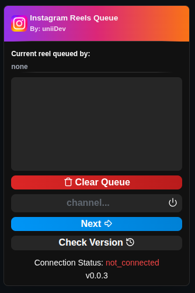
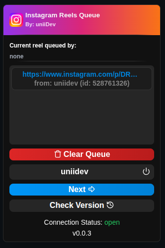

# Instagram Reels Queue

Original template:
<br> https://github.com/NekitCorp/chrome-extension-svelte-typescript-boilerplate

## Features

* **Moderation**
  - Any links from timed-out/banned users are instantly removed.
  - UI shows who sent the current reel.

* **Saving queue**
  - Queue persists in Chrome storage.

* **Tokenless**
  - No Twitch login required.

* **Quick clear**
  - Button to clear the entire queue fast.

* **Unique links**
  - No duplicate links.
  - All **/reels/** URLs convert to **/reel/**.


## Preview

<!--  -->



## Instalation

[Getting Started Tutorial](https://developer.chrome.com/docs/extensions/get-started/tutorial/hello-world#load-unpacked)

1. Open the Extension Management page by navigating to `chrome://extensions`.
2. Enable Developer Mode by clicking the toggle switch next to `Developer mode`.
3. Click the `LOAD UNPACKED` button and select the `/dist` or **in the uzipped release** directory.

## Development

```bash
# install dependencies
bun i

# build files to `/dist` directory
# HMR for extension pages and content scripts
bun run dev
```

## Build

```bash
# build files to `/dist` directory
$ bun run build
```
